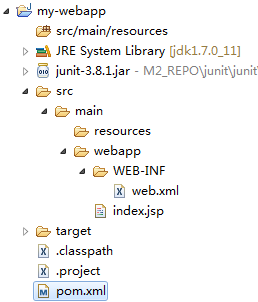

### Create

From [Guide to Webapps](http://maven.apache.org/guides/mini/guide-webapp.html) (-1)

	mvn archetype:generate -DgroupId=com.mycompany.app -DartifactId=my-webapp -DarchetypeArtifactId=maven-archetype-webapp
	
enters interactive mode

From <http://www.mkyong.com/maven/how-to-create-a-web-application-project-with-maven/> (-1)

	mvn archetype:generate -DgroupId=com.mycompany.app -DartifactId=my-webapp-mkyong -DarchetypeArtifactId=maven-archetype-webapp -DinteractiveMode=false
	
Prepare for Eclipse
	
	mvn eclipse:eclipse
	
	

	<project xmlns="http://maven.apache.org/POM/4.0.0" xmlns:xsi="http://www.w3.org/2001/XMLSchema-instance"
	  xsi:schemaLocation="http://maven.apache.org/POM/4.0.0 http://maven.apache.org/maven-v4_0_0.xsd">
	  <modelVersion>4.0.0</modelVersion>
	  <groupId>com.mycompany.app</groupId>
	  <artifactId>my-webapp</artifactId>
	  <packaging>war</packaging>
	  <version>1.0-SNAPSHOT</version>
	  <name>my-webapp Maven Webapp</name>
	  <url>http://maven.apache.org</url>
	  <dependencies>
	    <dependency>
	      <groupId>junit</groupId>
	      <artifactId>junit</artifactId>
	      <version>3.8.1</version>
	      <scope>test</scope>
	    </dependency>
	  </dependencies>
	  <build>
	    <finalName>my-webapp</finalName>
	  </build>
	</project>

.project

	<?xml version="1.0" encoding="UTF-8"?>
	<projectDescription>
	  <name>my-webapp</name>
	  <comment>NO_M2ECLIPSE_SUPPORT: Project files created with the maven-eclipse-plugin are not supported in M2Eclipse.</comment>
	  <projects/>
	  <buildSpec>
	    <buildCommand>
	      <name>org.eclipse.jdt.core.javabuilder</name>
	    </buildCommand>
	  </buildSpec>
	  <natures>
	    <nature>org.eclipse.jdt.core.javanature</nature>
	  </natures>
	</projectDescription>

.classpath

	<?xml version="1.0" encoding="UTF-8"?>
	<classpath>
	  <classpathentry kind="src" path="src/main/resources" excluding="**/*.java"/>
	  <classpathentry kind="output" path="target/classes"/>
	  <classpathentry kind="con" path="org.eclipse.jdt.launching.JRE_CONTAINER"/>
	  <classpathentry kind="var" path="M2_REPO/junit/junit/3.8.1/junit-3.8.1.jar"/>
	</classpath>	
	
So as you see it is static project with only `javanature`, dependencies are hard-coded in `.classpath`.  
eclipse:eclipse (maven-eclipse-plugin)	

	mvn tomcat:run

there is **Hello World!** at http://localhost:8080/my-webapp/  
check `<finalName>my-webapp</finalName>` in `pom.xml`  
